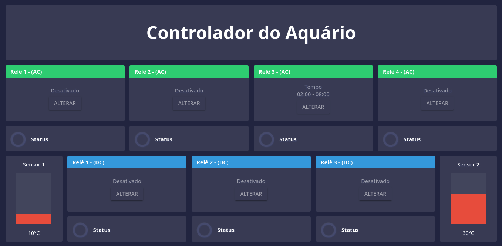

# DashboardIDS

A vuejs dashboard, based on [vuepoint](https://github.com/mattbrailsford/vuepoint).




## Build Setup

``` bash
# Install submodules
git submodule update --init .

# Go to Submodule folder
cd DashboadService

# Install dependencies
npm install

# Go back to root project
cd ..

# install dependencies
npm install

# serve at localhost:1337
npm run server

# or

# serve with hot reload at localhost:8080
npm run dev

# build for production with minification
npm run build
```

## Supported Tiles

* Value - Simple numeric value with before / after text
* Text - Text / html value tile
* List - List of label and value items
* Battery - A battery level indicator
* Gauage - A gauge display
* Level - A vertical level display
* Chart - A line, bar or doughnut chart
* Sparkline - A spirkline style chart
* Indicator - A true/false indicator

## Helper Components

* Date Time - A date time value (updates every 1 second)
* Weather - Outputs the temperature / icon of a city (updates every 15 minutes)
* Percentile Value - Show an up / down percentile change of value
* Min Value - Tracks the minimum value of passed readings
* Max Value - Tracks the maximum value of passed readings
* Avg Value - Calculate an average value of passed readings
* Ema Value - Exponential moving average of passed readings
* Animated Number - Animates a number change

## Acknowledgements

This dashboard uses the [vuepoint](https://github.com/mattbrailsford/vuepoint) dashboard framework as it's starting point. 

## License

Copyright © 2018 Edimar Calebe Castanho. Licensed under the [MIT License](LICENSE)